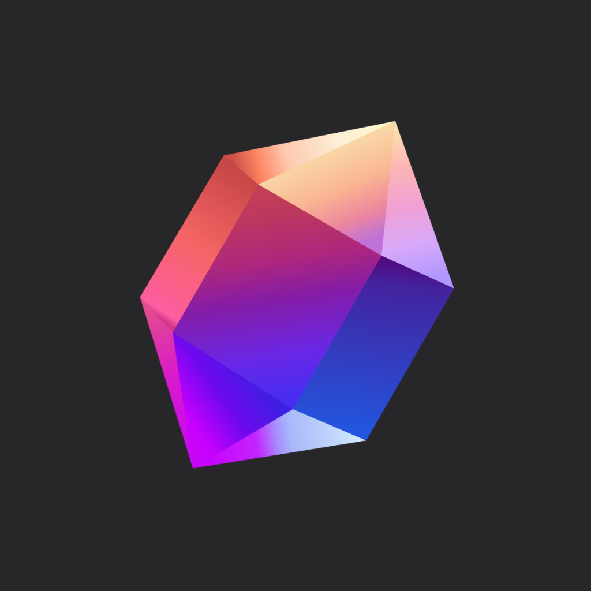

<p align="center">
  
</p>

<h1 align="center">Eskiwi</h1>

<p align="center">
  <strong>A creator-first social platform built for monetization, connection, and expression.</strong>
</p>

<p align="center">
  
  
  
  
</p>

<p align="center">
  <em>Built with love since 2024 — this project never made it to production, but the vision was fully realized in code. It was ready.</em>
</p>

---

## About

**Eskiwi** is a social platform designed to empower content creators with real tools to monetize their work, connect with their audience, and grow their brand. Think of it as a space where creators can share exclusive content, earn through multiple revenue streams, and have meaningful interactions with their supporters — all from a single app.

I started working on Eskiwi back in **2024** as a passion project. Over time it grew into a fully-featured application with authentication, payments, real-time messaging, subscriptions, and more. While it never saw the light of day and never made it to production, the app was feature-complete and ready to ship. Sometimes projects don't launch — but the work, the lessons, and the code remain.

---

## Features

### Content & Feed
- Post creation with multi-image support, cropping, and album organization
- Curated feed with recommended posts and creator discovery
- Like, comment, share, and interact with posts
- Subscription-gated content with tier-based access

### Monetization
- **Gems** — In-app currency for tipping creators on posts and comments
- **Subscriptions** — Up to 3 customizable tiers per creator with unique benefits
- **Paid Messaging** — Creators can set pricing for direct message requests
- **Ad Revenue** — Google AdMob integration

### Real-Time Messaging
- Direct messaging with chat requests and acceptance flow
- Image sharing in conversations
- Powered by Socket.IO for real-time delivery

### Creator Tools
- Earnings dashboard with daily transaction breakdowns and visual charts
- Subscriber management and tier customization
- Post management (edit, delete, organize)
- Creator verification via Instagram

### User Experience
- Dark-mode-first design with a bold pink accent palette
- Smooth animations with Lottie and React Native Reanimated
- Haptic feedback on interactions
- Full internationalization (English & Spanish)
- Push notifications
- Deep linking for profiles and posts

---

## Tech Stack

| Layer | Technology |
|---|---|
| **Framework** | React Native 0.74 + Expo 51 |
| **Navigation** | React Navigation v6 (Stack, Tabs, Drawer) |
| **State** | React Context API |
| **Networking** | Apisauce, Axios, Socket.IO |
| **Forms** | Formik + Yup |
| **UI** | React Native Paper, Bottom Sheet, Reanimated |
| **Payments** | RevenueCat (IAP), Stripe |
| **Ads** | Google Mobile Ads |
| **Auth** | JWT + Expo Secure Store |
| **Media** | Image Crop Picker, Camera Roll, Fast Image |
| **Charts** | Gifted Charts, Chart Kit |
| **i18n** | i18next + react-i18next |
| **Notifications** | Expo Notifications |
| **Animations** | Lottie, Confetti Cannon |

---

## Project Structure

```
app/
├── api/                  # API client, endpoints, and service layer
├── assets/               # Icons, fonts, images, Lottie animations
├── auth/                 # Auth context, token storage, session management
├── components/           # Reusable UI components organized by feature
│   ├── accountSettings/
│   ├── buyGems/
│   ├── chat/
│   ├── earnings/
│   ├── exploreCreator/
│   ├── forms/
│   ├── imagePicker/
│   ├── manageSubscriptions/
│   ├── modals/
│   ├── post/
│   └── ...
├── config/               # Colors, constants, and app configuration
├── hooks/                # Custom React hooks
├── locales/              # i18n translation files (en, es)
├── navigation/           # Navigation structure and route definitions
├── screens/              # Full-page screen components
└── utils/                # Utility functions and helpers
```

---

## Getting Started

### Prerequisites
- [Node.js](https://nodejs.org/) (v18+)
- [Expo CLI](https://docs.expo.dev/get-started/installation/)
- [EAS CLI](https://docs.expo.dev/eas/cli/) (for production builds)
- iOS Simulator, Android Emulator, or a physical device with Expo Go

### Installation

```bash
# Clone the repository
git clone https://github.com/your-username/Eskiwi-Frontend-RN.git
cd Eskiwi-Frontend-RN

# Install dependencies
npm install

# Start the development server
npx expo start
```

---

## License

This project is not licensed for public use. All rights reserved.

---

<p align="center">
  <sub>Eskiwi — built in 2024, shelved before launch. The app that was ready but never shipped.</sub>
</p>
